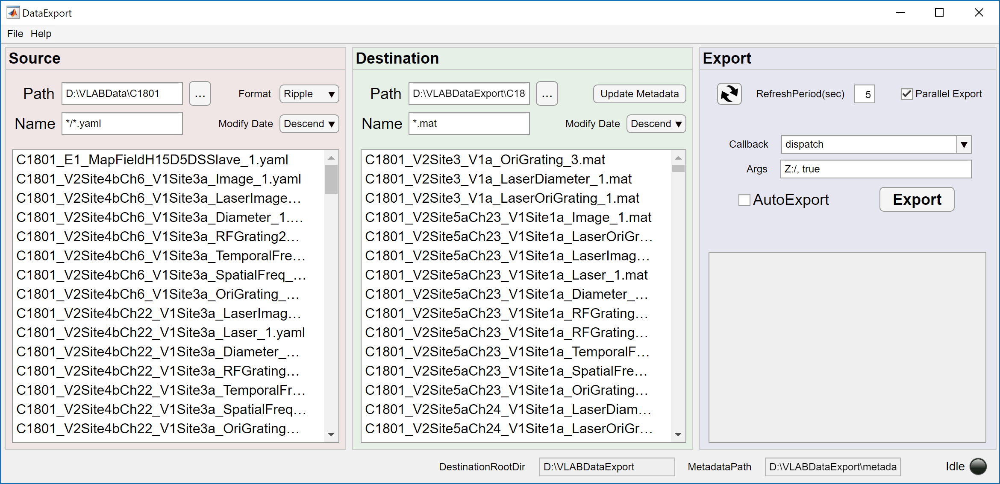

# NeuroAnalysis - Neural Signal Analysis

## DataExport - Export Dataset and Register Metadata

DataExport is the GUI for converting raw data in different formats of one complete experiment to one MATLAB mat file dataset. 

Supported data format: 
* [Ripple](https://rippleneuro.com/)
* [SpikeGLX](http://billkarsh.github.io/SpikeGLX/)
* [Optical Imageing](https://opt-imaging.com/)
* [Experica](https://experica.org/)
* Stimulator
* VisStim
* [Phy](https://github.com/cortex-lab/phy)

Spike Sorting can be incorporated in the process pipeline.

Supported Spike Sorting:
* [Kilosort2](https://github.com/MouseLand/Kilosort2) (need [npy-matlab](https://github.com/kwikteam/npy-matlab))

Automatic data export while data acquisiting can be enabled, the new completed data will be checked periodically and exported if any new data are found.

Subsequent data analysis could also be incoporated through Callback function which will be called after dataset been exported.

The metadata of each dataset will be collected while exporting and be registered in the metadata file in the export destination root directory. It can facilities the data analysis as a data registry database.