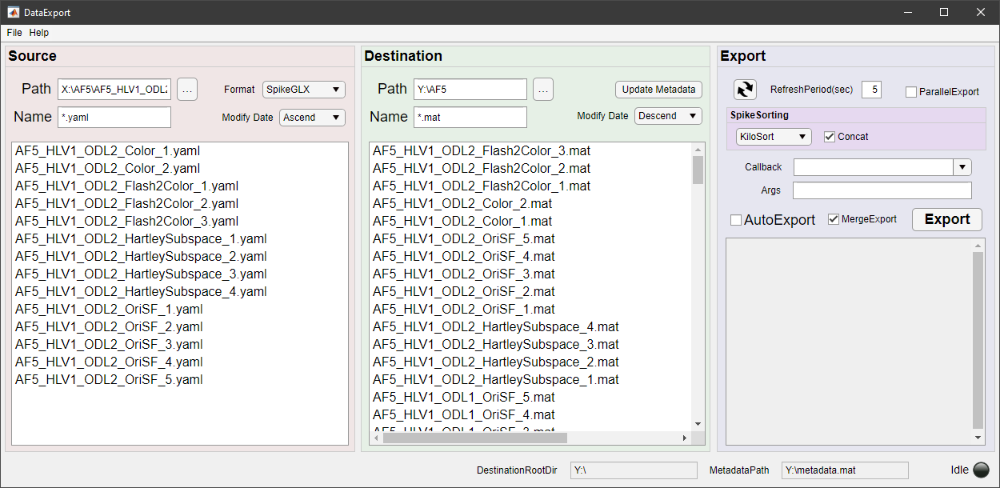

# NeuroAnalysis - Neural Signal Analysis

[Wiki](https://github.com/Experica/NeuroAnalysis/wiki)

## DataExport - Export Dataset and Register Metadata

DataExport is the GUI for converting raw data in different files and formats of a whole complete experiment to a dataset in a MATLAB mat file. 

Supported data format: 
* [Ripple](https://rippleneuro.com/)
* [SpikeGLX](http://billkarsh.github.io/SpikeGLX/)
* [Scanbox](https://scanbox.org/)
* [Optical Imaging](https://opt-imaging.com/)
* [Experica](https://experica.org/)
* Stimulator
* VisStim
* [Phy](https://github.com/cortex-lab/phy)

Spike Sorting can be incorporated in the pipeline.

Supported Spike Sorting:
* [Kilosort](https://github.com/MouseLand/Kilosort) (need [npy-matlab](https://github.com/kwikteam/npy-matlab))

Automatic data export while data acquisiting can be enabled, the new completely saved data will be checked periodically and exported if any were found.

Subsequent data analysis could also be incoporated through a callback function which will work on the dataset that just been exported.

The metadata of each dataset will be collected while exporting and be registered in the metadata file in the export destination root directory. It can facilite data analysis as a data registry.
